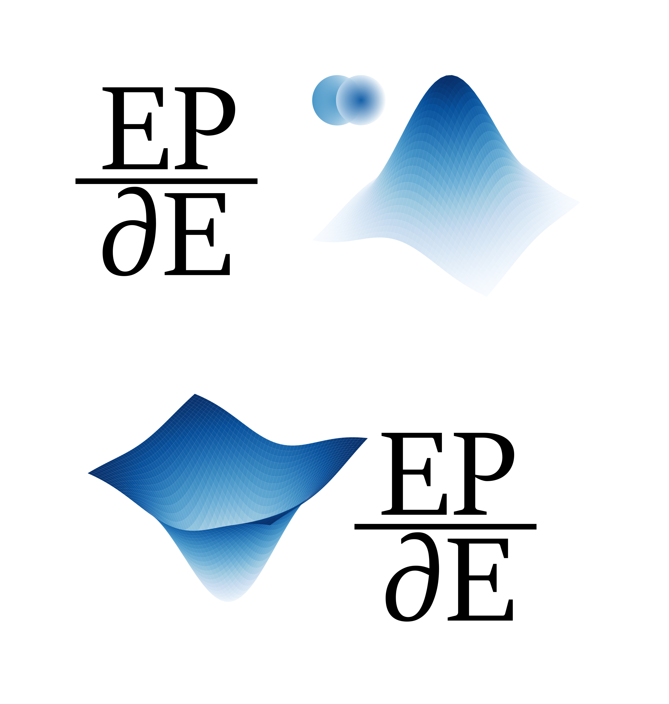

# EPDE

---

[](https://badge.fury.io/py/epde)
[](https://pepy.tech/project/epde)

[](https://github.com/aimclub/OSA)

Built with:


---

[](docs/epde_logo.png)

We use this repository as the main entry point for the EDPE framework.

We are of opinion that partial differential equations (PDE) discovery is more that the regression in the prescribed differential terms space. We propose the novel method of evolutionary equation discovery. Apart from the differential equations we have the algrbraic expressions discovery algorithm that is now uses same abstractions.

The project is maintained by the research team of the Natural Systems Simulation Lab, which is a part of the National Center for Cognitive Research of ITMO University.

---

## Overview

EPDE framework pioneers a novel evolutionary approach to discover governing equations, particularly partial differential equations, directly from data. It moves beyond traditional regression in predefined spaces, employing evolutionary algorithms to identify mathematical relationships within datasets. The core objective is to automate the discovery of these equations, enhancing surrogate modeling in natural sciences. EPDE features a multi-objective version for Pareto frontier analysis, a numerical differentiation scheme for noisy data, and a solver for visualizing the discovery process. By implementing evolutionary equation discovery, EPDE addresses real and synthetic data, contributing to data-driven differential equation-based model development as described in associated research articles.

The main features of the framework are as follows:

- We dont need to create prescribed library of terms - our 'building blocks' are single differential terms or simple functions
- We have the multi-objective version that allows to obtain Pareto frontier of the equations, which helps the expert to choose one from several equation. 
- We use our own numerical differntiaion scheme, which allows to deal with high noise values
- We have solver to visualize the differential equations discovery process to add more control (https://github.com/ITMO-NSS-team/torch_DE_solver)

---

## Table of Contents

- [Overview](#overview)
- [Content](#content)
- [Algorithms](#algorithms)
- [Installation](#installation)
- [Getting Started](#getting-started)
- [Examples](#examples)
- [Documentation](#documentation)
- [License](#license)
- [Citation](#citation)

---

## Content

The EPDE framework employs evolutionary algorithms to discover governing equations, particularly partial differential equations, from data. It eschews predefined term libraries, instead using fundamental differential terms and functions as building blocks. The framework integrates data input, preprocessing, symbolic regression, equation solving, and fitness evaluation. A key aspect is multi-objective optimization, generating a Pareto frontier of equations balancing accuracy and complexity. Numerical differentiation handles noisy data, and a solver aids visualization. The system iteratively refines equation structures through mutation, crossover, and sparse regression, identifying significant terms and weights. This approach facilitates data-driven equation derivation and surrogate model development, applicable to both synthetic and real-world data.

---

## Algorithms

The EPDE framework employs an evolutionary algorithm combined with sparse regression to discover partial differential equations from data. The evolutionary algorithm iteratively refines the equation structure through mutation and crossover operations. Sparse regression, specifically LASSO, is used to select significant terms and determine their weights within the equation. A numerical differentiation scheme handles noisy data. Multi-objective optimization allows for generating a Pareto frontier of potential equations, balancing accuracy and complexity. These algorithms facilitate the automated discovery of underlying equations from data, even in the presence of noise and high dimensionality, supporting surrogate modeling and data-driven equation derivation.

---

## Installation

**Prerequisites:** requires Python >=3.8

Common installation:

```sh
pip install epde
```

---

## Getting Started

To get started with EPDE, you can install the package using pip:

```
pip install epde
```

Then, explore the examples provided in the `examples` directory. For instance, the `ODE discovery.ipynb` notebook demonstrates how to discover ordinary differential equations using the EPDE framework. It covers topics such as:

- Generating synthetic data from known ODEs.
- Setting up the `EpdeSearch` object with appropriate parameters.
- Using trigonometric and grid tokens to enhance the search.
- Visualizing and interpreting the discovered equations.

Also, there is an intro video about EPDE:

[](https://www.youtube.com/watch?v=BSXGCeuTcdc)

---

## Examples

Examples of how this should work and how it should be used are available [here](https://github.com/ITMO-NSS-team/EPDE/tree/main/examples).

---

## Documentation

A detailed EPDE description is available [here](https://github.com/ITMO-NSS-team/EPDE/tree/main/docs).

---

## License

This project is protected under the Other. For more details, refer to the [LICENSE](https://github.com/ITMO-NSS-team/EPDE/tree/main/LICENSE.txt) file.

---

## Citation

@article{maslyaev2021partial,
  title={Partial differential equations discovery with EPDE framework: application for real and synthetic data},
  author={Maslyaev, Mikhail and Hvatov, Alexander and Kalyuzhnaya, Anna V},
  journal={Journal of Computational Science},
  pages={101345},
  year={2021},
  publisher={Elsevier}
}

@article{maslyaev2019discovery,
  title={Discovery of the data-driven differential equation-based models of continuous metocean process},
  author={Maslyaev, Mikhail and Hvatov, Alexander},
  journal={Procedia Computer Science},
  volume={156},
  pages={367--376},
  year={2019},
  publisher={Elsevier}
}